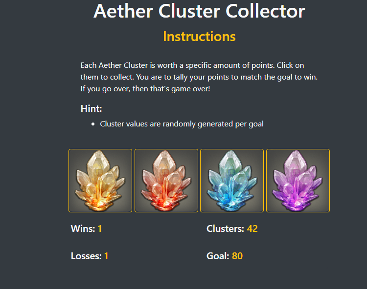

# unit-4-b Crystal Collector

## Summary
A game where the user clicks on Aether Clusters to collect a value equal to the goal. To win, the user must collect the exact amount of clusters to match the randomly generated goal by clicking on the clusters. If the cluster amount surpasses the goal amount, the user loses and a new goal is generated with new cluster values.

### **Functions:**
- Wins counter increases when the goal is met
- Losses counter increases when the cluster value is higher than the goal
- Click on clusters to collect

### **Balancing:**
- Clusters' values will always be different from one another
- Goal is based off of the clusters' values, so it's always possible to win.

## Site Picture


## Technologies Used
- HTML
- Bootstrap
- Javascript
- Git
- GitHub
- VSCode

## Links
Live Page: https://seiretsym.github.io/unit-4-game<br>
Repo: https://github.com/seiretsym/unit-4-game<br>
LinkedIn: https://www.linkedin.com/in/kerwinhy/<br>
GitHub: https://github.com/seiretsym<br>

## Code Snippet
I chose these lines of code because they ensure that the clusters never carry the same value as other clusters. The goal can be achieved no matter what the cluster values are because it's based on the values of the clusters.
```
// generate random values for each cluster
function randCluster() {
    // generate random values for each cluster
    clust1.val(Math.floor(Math.random() * 11) + 2);
    clust2.val(Math.floor(Math.random() * 11) + 2);
    clust3.val(Math.floor(Math.random() * 11) + 2);
    clust4.val(Math.floor(Math.random() * 11) + 2);

    // randomize clust2 value if it's the same as clust1
    do {
        clust2.val(Math.floor(Math.random() * 11) + 2);
    }
    while (clust2.val() === clust1.val());

    // randomize clust3 value until it doesn't match clust1 or clust2
    do {
        clust3.val(Math.floor(Math.random() * 11) + 2);
    }
    while (clust3.val() === clust1.val() || clust3.val() === clust2.val());

    // randomize clust3 value until it doesn't match clust1 or clust2 or clust3
    do {
        clust4.val(Math.floor(Math.random() * 11) + 2);
    }
    while (clust4.val() === clust1.val() || clust4.val() === clust2.val() || clust4.val() === clust3.val()); 
}

// generate random value for goal based on cluster values
function randGoal(obj) {
    var total = 0;
    // generate a random value for goal based on cluster values
    total += clust1.val() * (Math.floor(Math.random() * 5) + 1);
    total += clust2.val() * (Math.floor(Math.random() * 5) + 1);
    total += clust3.val() * (Math.floor(Math.random() * 5) + 1);
    total += clust4.val() * (Math.floor(Math.random() * 5) + 1);

    // update goal value and text
    goal.val(total);
    goal.text(goal.val());
} 
```